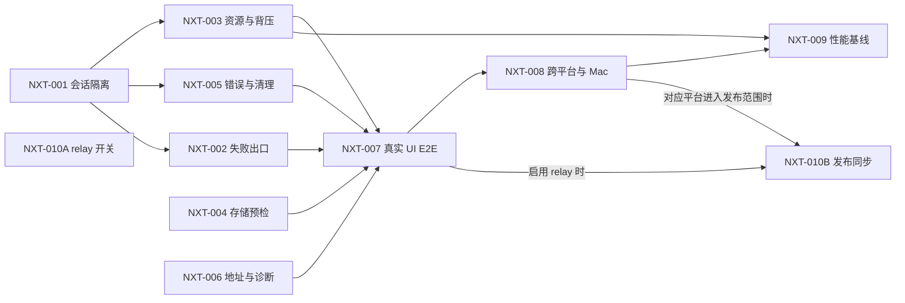

入口判断：/idea
交付模式：Vibe Coding 全流程型

# /idea 需求池 - 2026-09-05

## 追踪信息

- 当前状态：本次明确代码缺陷及本地自动化修复已收口；新远端 CI、其他平台运行和 L3 真机验收仍待补证
- 目标版本：v0.2 发布收口；不自动升级为 v0.3
- 上游来源：`REV-V02-20260905`（2026-09-05 当前任务中的深度 Review；证据附录已固化于本文）
- 审查对象：`main@7566fb7..test@79d4684`，工作树在审查结束时干净
- 上游事实源：`docs/prd_v0.2.md`、`docs/dev_plan_v0.2.md`、`docs/progress_v0.2.md`、`docs/dev_log_v0.2.md`
- 下游承接：Bugfix 收口 → L2 自动化验收 → 首个跨系统 L3 真机补证（优先 Windows↔macOS）→ 发布收口
- 当前事实源：本文；需求状态变化回写本文，实现进度仍回写 `docs/progress_v0.2.md`
- 最后更新：2026-09-05（Asia/Shanghai）
- 授权边界：用户以 `go`、随后“继续”及“继续到完成本次全部修复”授权修复，完成后又同意先提交推送 `test` 跑 CI；提交/推送已授权，main 合并、tag、Release 和可见性变更仍未授权

## 总体判断

- 本次来源：v0.2 深度 Review、源码可达路径、一次性故障复现、当前测试与 GitHub Actions 结果。
- 本版本主线：修正会话隔离、直连失败出口、中转资源边界和存储预检，补齐真实 UI 与跨平台运行证据，使 v0.2 从“L2 实现候选”进入可发布候选。
- 审查时的核心缺口：真机直连已有一次成功反馈；当时加密中转只有模块测试和浏览器内协议集成证据。后续两批已补真实 UI 与异常回归；慢网络性能及跨平台产物验证仍未闭环，最新状态见执行记录。
- 为什么不是更大的方向：当前缺口直接影响隐私、核心中转路径和发布可信度；此时增加剪贴板、文件夹、自动发现或移动端，会扩大状态面并延后 v0.2 收口。
- 直接进入 `/prd`：无。现有 v0.2 产品合同已足够，明确缺陷直接进入 Bugfix；只有合同发生变化时才回写 PRD。
- 现在直接做：`NXT-001`～`NXT-006`，以及 `NXT-010A` relay 前置开关。
- 继续验证：`NXT-007`～`NXT-009`。
- 发布治理：`NXT-010A` 先提供可回滚边界；`NXT-010B` 在代码和验证门禁完成后同步发布事实。
- 暂不做：局域网剪贴板、文件夹发送、自动设备发现、移动端、云中转、公网部署和断点续传。
- 进入开发授权：已获得本次全部修复实施授权；不扩大为新功能迭代，不将自动化通过等同于真机验收。

## 首批执行记录（2026-09-05）

- 范围：NXT-001 / NXT-003 / NXT-005 / NXT-010A；复用 NXT-007 的真实 UI 方法补定向回归，但不提前关闭整个 NXT-007。
- 实现：会话独立所有权、房间文件快照、pending/active 中转取消；房间关联凭据吊销、唯一授权、容量/超时/有界背压；一次终止事件与握手取消；可关闭中转的 runtime/UI 合同。
- 默认值策略修订：工程 Agent 选择可配置的保守初始值，沿用已有 60 秒凭据和 256 KiB 帧上限；新增值与依据见 PRD/README。它们不是用户确认的性能阈值，也不是测量得出的最佳参数；后续真机数据可驱动调整。本批默认仍启用中转，不扩大原有发布范围。
- 验证记录与最终状态：以 `docs/progress_v0.2.md`、`docs/dev_log_v0.2.md` 的本批最新结果为准；原 E-ID 附录保留作为修复前证据。
- 本批结论：NXT-001 / 003 / 005 / 010A 已修复并通过自动化；149 tests / 520 assertions 全绿，真实 UI 中转及会话竞态回归通过。NXT-007 仅部分补齐，不能代替其余缺陷与真机发布门禁。
- 后续：NXT-002（非超时直连失败出口）、NXT-004（真实可写预检）、NXT-006（地址和诊断）仍待实施；Mac/TUN/吞吐暂不占用用户时间。

## 第二批执行记录（2026-09-05）

- 范围：NXT-002 / NXT-004；继续复用 NXT-007 真实 UI 方法，不宣称完整门禁已关闭。
- NXT-002：统一 RTC 失败边界并保留房间；路线验证期间禁止接受文件；失败后双方批准可完成中转。拒绝中转不再隐式离房，实际传输开始后断线则整轮终止，不中途改路。
- NXT-004：接受前执行小型 create/write/close/remove 探针；OPFS 不可写时仅在原内存合同内回退，超限保持禁止接受；实际存储后端锁定，旧预检和晚到 sink 在取消后清理。探针不代表整批磁盘容量保证。
- 结论：NXT-002 / NXT-004 已修复并通过本地回归；199 tests / 680 assertions 及新增 13 个真实浏览器场景全绿，旧直连/中转/UI 回归通过。细节与产物身份回写 progress/dev log。
- 剩余：NXT-006 完整地址/诊断、NXT-007 CI 接线与完整门禁、NXT-008/009 真机与性能。Mac/TUN/吞吐仍留待用户方便时验收；无提交推送或发布动作。

## 全部修复收口记录（2026-09-05）

- NXT-001～006、010A 的明确代码缺陷已修复并通过本地回归；原 E-ID 附录保留为修复前事实，不代表缺陷仍存在。
- 本轮补完 NXT-006 推荐/备选地址、空列表与读取失败、两端真实时间线、脱敏诊断和手动复制，落实 UX-01～03；额外回归关闭货单重试串换、连续查码错误陈旧、断连误状态、成功被晚关闭覆盖及无效中转按钮。
- NXT-007：统一浏览器入口全部通过，包括新 diagnostics 15 场景、recovery 13 场景与既有 direct/UI/lifecycle；CI 已接线，提交推送已授权，新远端结果按该提交验证。
- NXT-008 自动化部分：原生 smoke 脚本及四平台 CI 步骤完成；当前 Windows 新候选已启动并完整核对 10 项资源、安全关闭和正常退出。其他平台本轮运行及所有跨设备矩阵仍待补证。
- NXT-010B：本地状态、checksum 与发布待执行清单已同步；不提前关闭远端发布和真机门禁。NXT-009 保持未调参/待基线，N4 数值未升级为正式要求。
- 最终证据：217 tests / 757 assertions、统一浏览器全量、bundle、Windows 原生 smoke、依赖审计与差异检查通过。对象、产物哈希、限制及下一步集中见 `docs/progress_v0.2.md`；过程见 dev log，不在各候选条目复制日志。

## 证据映射

| 来源证据 | 对应候选需求 | 证据等级 | 说明 |
|---|---|---|---|
| E-001 | NXT-001 | 强 | 会话所有权与跨会话隔离缺口；完整事实见证据附录 E-001。 |
| E-002 | NXT-002 | 强 | 非超时直连失败后的恢复出口缺口；完整事实见证据附录 E-002。 |
| E-003、E-004 | NXT-003 | 强 | 中转生命周期、授权数量与背压缺口；完整事实见证据附录 E-003/E-004。 |
| E-005 | NXT-004 | 强 | 存储预检与实际可写能力不一致；完整事实见证据附录 E-005。 |
| E-006 | NXT-005 | 强 | transport 关闭事件未传播；完整事实见证据附录 E-006。 |
| E-007、U-002 | NXT-006 | 强 / 中 | 地址、诊断和真实网络观察；完整事实见证据附录 E-007/U-002。 |
| E-008 | NXT-007 | 强 | 真实 UI 中转覆盖缺口；完整事实见证据附录 E-008。 |
| E-009、U-001 | NXT-008 | 强 / 中 | 原生构建与设备可用性边界；完整事实见证据附录 E-009/U-001。 |
| E-010、U-003 | NXT-009 | 中 | 性能实现事实与用户主观反馈；完整事实见证据附录 E-010/U-003。 |
| E-011 | NXT-010 | 强 | feature flag 与发布事实漂移；完整事实见证据附录 E-011。 |
| E-012 | 全部 | 强 | 基础回归与依赖审计基线；完整事实见证据附录 E-012。 |

## Review 证据附录

- 证据环境：Windows、PowerShell、Bun 1.3.14；仓库 `E:\codex\LocalFileTransfer`；分支 `test`；HEAD `79d4684985836f42494164b20b093db594397d10`；2026-09-05（Asia/Shanghai）。
- 失效条件：对应源码、测试、依赖、构建配置或 HEAD 变化后，只重开受影响 E-ID；纯文档调整不使运行证据自动失效。

| 证据 | 方法 / 注入 | 关键结果 | 可复核位置 |
|---|---|---|---|
| E-001 | 静态跟踪 `releaseSession → openRelayTransport → setupSender` 的异步边界 | N1 已确认事实：pending transport 未被会话持有；await 后读取新的 `sessionRole/selectedFiles` | `src/web/app.js:271-294,516-552,732-754` |
| E-002 | 静态跟踪 `direct_path:false → channel.close → data_channel:closed → releaseSession` | N1 已确认事实：失败面板保留，但 signaling session 被释放，后续 `requestRelay` 为空操作 | `src/web/peer-session.js:277-285`、`src/web/app.js:567-576,647-648,681-689,876-883` |
| E-003 | 执行下方“E-003 复现命令” | N1 已确认事实：`{"sessions":1,"connections":1,"receiverCanStillClaim":false}` | `src/relay-hub.ts:23-85` |
| E-004 | 执行下方“E-004 复现命令” | N1 已确认事实：`{"authorizationsPerRound":[1,1,1],"credentialCalls":9}` | `src/signaling-core.ts:397-437` |
| E-005 | 执行下方“E-005 复现命令” | N1 已确认事实：300 MiB 预检 `allowed:true`；创建时报 `STORAGE_LIMIT_EXCEEDED`，内存上限为 268,435,456 字节 | `src/web/storage.js:29-54,203-241` |
| E-006 | 执行下方“E-006 复现命令” | N1 已确认事实：`{"readyState":"closed","closeEvents":0,"socketState":3}` | `src/web/relay-transport.js:39-103` |
| E-007 | 检查 runtime 消费和诊断生成代码 | N1 已确认事实：首页只消费 `recommendedUrl`，空 LAN 时仍复制 localhost；诊断固定为 `DIRECT_TIMEOUT/20s` | `src/runtime-info.ts:42-53`、`src/web/app.js:899-913,981-1016` |
| E-008 | 检查 Playwright 动态路径 | N1 已确认事实：中转使用单页 `page.evaluate` 直接创建底层对象，没有点击真实双方 UI | `tests/ui_prototype_test.py:88-159` |
| E-009 | `gh run view 33894188120` 与 workflow 对照 | N1 已确认事实：test、Windows x64、macOS arm64、macOS x64、Linux x64 jobs 均成功；build job 只有编译与上传 | `.github/workflows/build.yml:12-55` |
| E-010 | 检查传输参数和中转轮询 | N1 已确认事实：固定 16 KiB 分块；RelayTransport 在超过低水位时逐次触发 20 ms 轮询 | `src/web/transfer.js:1-5,258-268`、`src/web/relay-transport.js:81-96` |
| E-011 | 对照 PRD、progress、dev plan、convergence、README 与实现 | N1 已确认事实：状态、分支和健康检查文本漂移；PRD 声称 relay feature flag，实现不存在 | `docs/prd_v0.2.md:144-172`、`docs/progress_v0.2.md:1-100`、`src/server.ts:85-100,154-165` |
| E-012 | `bun test`；`bun audit` | N1 已确认事实：`113 pass / 0 fail / 362 expect()`；`No vulnerabilities found` | 当前 HEAD；执行时间 2026-09-05 |
| U-001 | 用户输入：“linux目前不好验证，但是mac可以” | 中证据：Mac 可用于后续验证，Linux 当前验证困难；设备信息与结果仍待登记 | 当前任务对话 |
| U-002 | 用户输入：“我关闭了tun，成功了，不过为了使用gppt方便又打开了tun” | 中证据：TUN 开启时失败、关闭后成功；只支持相关性，不证明单一因果 | 当前任务对话 |
| U-003 | 用户输入：“似乎并不快” | 中证据：存在真实速度感受，但无文件大小、路径、耗时和吞吐口径 | 当前任务对话 |

一次性复现使用当前 HEAD 和 Bun 1.3.14；命令均从仓库根目录执行：

```powershell
# E-003：半连接 relay 跨过凭据 TTL 后仍残留
bun -e 'import { RelayHub } from "./src/relay-hub.ts"; let now = 0; const hub = new RelayHub({ now: () => now, credentialTtlMs: 60000, maxFrameBytes: 262144 }); hub.authorize("session", "sender-token", "receiver-token"); hub.claim("sender-token", "sender-connection"); now = 60001; hub.sweep(); console.log(JSON.stringify({ sessions: (hub as any).sessions.size, connections: (hub as any).connectionIndex.size, receiverCanStillClaim: hub.claim("receiver-token", "receiver-connection") !== null }));'
```

```powershell
# E-004：同一房间重复签发 relay
bun -e 'import { SignalingCore } from "./src/signaling-core.ts"; let n = 0; const core = new SignalingCore({ roomTtlMs: 600000, maxMessageBytes: 65536, joinRateLimit: { maxAttempts: 5, windowMs: 60000 } }, { now: () => 0, nextRoomCode: () => "583204", nextRelayCredential: () => `credential-${++n}` }); core.connect({ id: "sender", clientKey: "a" }); core.connect({ id: "receiver", clientKey: "b" }); core.receive("sender", JSON.stringify({ type: "create_room" })); core.receive("receiver", JSON.stringify({ type: "join_room", code: "583204" })); core.receive("sender", JSON.stringify({ type: "approve_join" })); const counts = []; for (let i = 0; i < 3; i += 1) { core.receive("sender", JSON.stringify({ type: "request_relay" })); counts.push(core.receive("receiver", JSON.stringify({ type: "approve_relay" })).filter((action) => action.kind === "authorize_relay").length); } console.log(JSON.stringify({ authorizationsPerRound: counts, credentialCalls: n }));'
```

```powershell
# E-005：OPFS 表面可用、实际不可写
bun -e 'import { assessStorageCapability, createStorage } from "./src/web/storage.js"; const navigator = { storage: { getDirectory: async () => ({ getFileHandle: async () => ({ createWritable: async () => { throw new DOMException("quota", "QuotaExceededError"); } }), removeEntry: async () => {} }) } }; const size = 300 * 1024 * 1024; const capability = await assessStorageCapability([{ name: "large.bin", size }], navigator); let createError = null; try { await createStorage({ name: "large.bin", size, navigator }); } catch (error) { createError = { name: error.name, code: error.code, message: error.message }; } console.log(JSON.stringify({ capability, createError }));'
```

```powershell
# E-006：认证失败关闭 transport，但未通知上层 close
bun -e 'import nacl from "tweetnacl"; import { RelayTransport } from "./src/web/relay-transport.js"; class WS { static instances=[]; constructor(url){ this.url=url; this.readyState=0; this.bufferedAmount=0; WS.instances.push(this); } send(value){ this.sent ??= []; this.sent.push(value); } open(){ this.readyState=1; this.onopen?.(); } receive(value){ this.onmessage?.({data:value}); } close(){ this.readyState=3; this.onclose?.(); } } const left=new RelayTransport({token:"a",WebSocketImpl:WS,location:{protocol:"http:",host:"x"},naclImpl:nacl}); const right=new RelayTransport({token:"b",WebSocketImpl:WS,location:{protocol:"http:",host:"x"},naclImpl:nacl}); const lp=left.connect(); const rp=right.connect(); const [ls,rs]=WS.instances; ls.open(); rs.open(); ls.receive(JSON.stringify({type:"relay_open"})); rs.receive(JSON.stringify({type:"relay_open"})); rs.receive(ls.sent[0]); ls.receive(rs.sent[0]); await Promise.all([lp,rp]); let closes=0; left.addEventListener("close",()=>closes++); const tampered=right.cipher.seal("secret"); tampered[tampered.length-1]^=1; ls.receive(tampered); console.log(JSON.stringify({readyState:left.readyState,closeEvents:closes,socketState:ls.readyState}));'
```

## 需求总览

| ID | 标题 | 类型 | 证据等级 | 压力测试分数 | 置信度 | 分档结论 | 依赖关系 | 建议去向 | 最小下一步 |
|---|---|---|---|---|---|---|---|---|---|
| NXT-001 | 中转会话所有权与跨会话隔离 | 隐私 Bugfix | 强 | 跳过：E-001 为可达源码路径 | 高 | 发布阻断、高价值 | 无 | 现在直接做 | 增加 session generation、文件快照和 pending/active relay 所有权测试。 |
| NXT-002 | 统一直连失败出口并保留中转能力 | 核心路径 Bugfix | 强 | 跳过：E-002 直接破坏核心出口 | 高 | 发布阻断、高价值 | NXT-001 的会话模型可复用 | 现在直接做 | 强制 `direct_path:false`，验证仍能申请并完成中转。 |
| NXT-003 | 中转资源上限、空闲回收与服务端背压 | 稳定性/安全 Bugfix | 强 | 跳过：E-003/E-004 已复现 | 高 | 发布阻断、高价值 | NXT-001 | 现在直接做 | 定义每房间唯一 relay、容量、期限、队列及 `RELAY_LIMIT`。 |
| NXT-004 | 真实可写的浏览器存储预检 | 数据可靠性 Bugfix | 强 | 跳过：E-005 已复现 | 高 | 发布阻断、高价值 | 无 | 现在直接做 | 接受前完成 create/write/remove 探针或预分配 sink。 |
| NXT-005 | 中转错误传播与幂等清理 | 可靠性 Bugfix | 强 | 跳过：E-006 已复现 | 高 | 高价值 | NXT-001 | 现在直接做 | tamper/replay 后保证 engine failed、sink abort、close 只通知一次。 |
| NXT-006 | 真实 LAN 地址与诊断合同 | 可用性 Bugfix | 强 | 跳过：E-007 为确定偏离 | 高 | 高价值 | 无 | 现在直接做 | 覆盖多网卡、无 LAN、实际错误码和候选类型。 |
| NXT-007 | 完整双浏览器中转 UI E2E | 质量门禁 | 强 | 跳过：E-008 为明确覆盖缺口 | 高 | 发布门禁 | NXT-001～NXT-006 | 继续验证 | 两个浏览器上下文完成失败、批准、清单、下载和字节比对。 |
| NXT-008 | 原生产物 smoke 与 Windows↔macOS 真机 | 跨平台验证 | 强 | 跳过：E-009 为明确覆盖缺口 | 高 | 对应平台/兼容声明门禁 | NXT-001～NXT-007 | 继续验证 | CI 启动四产物；登记 Mac 环境后完成双向直连与至少一组 TUN 中转。 |
| NXT-009 | 吞吐基线与证据驱动调优 | 性能验证 | 中 | 不评分：缺吞吐基线 | 中 | 小范围验证 | NXT-003、NXT-007、NXT-008 | 继续验证 | 使用合同内文件先测直连/中转/TUN，再比较 16/64/128 KiB 与单一 drain waiter。 |
| NXT-010 | 中转回滚开关与发布事实同步 | 实施 + 发布治理 | 强 | 跳过：E-011 为确定偏离 | 高 | A 现在做；B 正式发布前做 | NXT-010A 无；NXT-010B 依赖所选发布面对应门禁；NXT-009 只阻塞“更快”声明 | 分阶段承接 | A 实现 relay flag；B 统一状态、分支、健康检查和 Release 材料。 |

## 执行卡

| ID | 负责人角色 | 输入 | 可检查产物 | 通过标准 | 停止 / 转向条件 | 确认点 | 回写位置 |
|---|---|---|---|---|---|---|---|
| NXT-001 | 实施 Agent | E-001、v0.2 PRD、当前 session 状态 | 会话代次/所有权实现与跨会话回归测试 | 延迟旧 token 后旧通道关闭；新文件对旧通道保持 0 帧；全部相关测试通过 | 需要改变双方确认语义时停止并回 `/prd` | Bugfix 批次开始 | `docs/progress_v0.2.md`、`docs/dev_log_v0.2.md`、本文 |
| NXT-002 | 实施 Agent | E-002、NXT-001 | 统一 `direct_failed` 状态与 UI 集成测试 | `direct_path:false` 后 signaling 仍在线；可重试、可申请中转、可退出 | WebRTC 与 signaling 无法解耦时先输出技术方案，不弱化出口 | NXT-001 接口稳定后 | `docs/progress_v0.2.md`、`docs/dev_log_v0.2.md`、本文 |
| NXT-003 | 实施 Agent | E-003/E-004、Bun WebSocket 背压语义 | 有界 RelayHub、配置项、慢接收方/容量/超时测试 | 达上限明确拒绝；慢接收方无静默丢帧；超时或断开后容量恢复 | 不将可配置工程初始值冒充已测性能阈值 | 首批授权后采用上述默认值策略；性能调优另行采样 | `docs/progress_v0.2.md`、`docs/dev_log_v0.2.md`、本文 |
| NXT-004 | 实施 Agent | E-005、F6 存储合同 | 真实可写预检与前置失败测试 | OPFS 写入失败时接受按钮不可用；文件字节发送量为 0；临时探针清理 | 浏览器 API 无法可靠探针时回到“限制内存模式”方案确认 | 存储实现批次开始 | `docs/progress_v0.2.md`、`docs/dev_log_v0.2.md`、本文 |
| NXT-005 | 实施 Agent | E-006、NXT-001 | one-shot 终止器和异常回归 | tamper/replay/close/cancel 均有唯一终态；sink abort；cipher 清零；无挂起 Promise | 事件语义影响 transfer contract 时停止并评审 | NXT-001 完成后 | `docs/progress_v0.2.md`、`docs/dev_log_v0.2.md`、本文 |
| NXT-006 | 实施 Agent | E-007、现有 runtime API 合同 | 地址/诊断/时间线 UI 与测试 | 消费完整 `lanUrls`；空数组不引导其他电脑访问 localhost；诊断与真实错误一致；三个文案验收通过 | 如需新增网卡名称/IP 分类字段，停止并回 `/prd` 处理 API/隐私变化 | UI 批次开始 | `docs/progress_v0.2.md`、`docs/dev_log_v0.2.md`、本文 |
| NXT-007 | 实施 Agent | NXT-001～NXT-006 的候选实现 | 两浏览器真实 UI E2E 和测试证据 | 强制直连失败后双方批准；接受前 0 B；下载字节一致；退出后资源归零 | 禁止退回 demo 或底层对象绕过；无法注入时先补 test seam | 前置 Bugfix 全绿后 | `docs/progress_v0.2.md`、`docs/dev_log_v0.2.md`、测试产物 |
| NXT-008 | 实施 Agent + 用户真机操作 | CI artifacts、Mac 设备信息、NXT-007 | 四平台 smoke 日志和真机验证记录 | 每个 CI 产物完成启动/health/runtime/页面/退出；已执行真机方向逐字节一致 | Linux 无设备则标“待补证”；某平台失败只阻塞该产物/声明 | 真机前登记 OS/CPU/浏览器 | `docs/progress_v0.2.md`、手动验证记录、本文 |
| NXT-009 | 实施 Agent + 用户真机操作 | NXT-003/NXT-007/NXT-008、基准文件 | 原始测量表、对比结果和参数决策 | 按实验卡完成并只采用满足 N4 建议值的简单候选；否则保留基线实现 | N4 建议默认：任一字节不一致、连续 60 秒确认字节无增长或峰值 RSS >基线+20% 即回退候选；确认前不是正式门禁 | PERF 批次开始前确认 N4 | `docs/progress_v0.2.md`、本文 NXT-009 |
| NXT-010A | 实施 Agent | E-011、现有直连/relay 合同 | relay feature flag、runtime/UI 接线与启停测试 | flag 关闭时直连与诊断可用；relay 不可申请且 `/relay` 拒绝；重新启用后回归通过 | 默认开关策略会改变发布范围时，先由用户确认 | 首个 Bugfix 批次开始 | `docs/progress_v0.2.md`、`docs/dev_log_v0.2.md`、本文 |
| NXT-010B | 实施 Agent；外部发布由用户授权 | 所选发布面对应证据、发布状态 | 同步文档、候选 checksum、待授权发布清单 | 所选发布面的门禁通过；状态、平台/relay 限制与证据一致；本地材料可复核 | 未获 tag/Release/push 授权则只生成本地材料 | 所选发布面 Acceptance 通过后 | README、PRD/progress/dev log、本文 |

## 依赖关系



## 三档范围方案

| 档位 | 内容 | 适合阶段 | 风险 |
|---|---|---|---|
| 最小方案 | NXT-001～NXT-005，加对应定向回归 | 内部 Bugfix 候选 | 仍缺真实 UI、跨平台运行和性能证据，不能作为公开 v0.2。 |
| 推荐方案 | NXT-001～NXT-008 与 NXT-010；NXT-009 同轮采集基线但不阻塞无“更快”承诺的发布；Linux 物理真机若无设备则明确“待补证” | v0.2 发布候选 | 工作量高于最小方案，但不增加新用户功能，风险边界清楚。 |
| 过大方案 | 在推荐方案上同时增加剪贴板、文件夹、自动发现、移动端、云中转或断点续传 | 后续独立版本 | 扩大协议、权限、浏览器兼容和状态机，掩盖本轮可靠性收口。 |

## 发布影响面门禁

| 发布面 / 声明 | 必须完成 | 可保留待补证 |
|---|---|---|
| 源码继续在 `test` 开发 | 当前需求池即可 | 全部实现与真机项 |
| 直连-only Windows 候选产物 | NXT-002、NXT-004、NXT-006、NXT-010A；relay flag 关闭 | NXT-001、NXT-003、NXT-005、NXT-007、NXT-008 的非 Windows 部分、NXT-009 |
| 启用本地中转的 v0.2 候选 | NXT-001～NXT-007、NXT-010A | NXT-009；不能宣传“更快” |
| macOS 可运行声明 | NXT-008 的 macOS 原生产物 smoke | Windows↔macOS 真机未做时，不声明跨系统已验证 |
| Linux 可运行声明 | NXT-008 的 Linux 原生产物 smoke | Linux 物理跨机传输可明确“待补证” |
| Windows↔macOS 已验证声明 | NXT-008 中登记设备后的双向真实传输 | Linux 组合 |
| “局域网快传/性能更快”量化声明 | NXT-009 的基线、口径与通过结果 | 未测路径不得外推 |
| `v0.2.0` tag / GitHub Release | 启用范围对应门禁通过、文档同步、用户另行授权 | 不在发布范围的平台必须明确限制 |

## 需求详情

### NXT-001 中转会话所有权与跨会话隔离

- 原始输入：REV-V02-20260905 / E-001。
- 输入类型：隐私与授权边界 Bug。
- 产品问题：用户结束旧传输后，旧通道不得读取或发送新一轮选择的文件。
- 目标用户 / 场景：发送方取消已批准但仍在握手的旧中转，随后立即开始新传输。
- 当前替代方案：刷新页面或重启服务；用户无法知道旧握手仍存活。
- 证据盘点：源码路径完整且可达；尚缺自动化攻击回归。
- 数据分析：不需要频率数据；单次跨会话文件泄露即可阻断发布。
- 价值判断：高价值，保护文件选择与接收授权的会话边界。
- 当前阶段：Bugfix 收口。
- 压力测试分数：不评分；强证据且隐私后果明确，评分不会改变决策。
- 判断置信度：高。
- 低分项：无；需要补的是自动化证据，不是价值证据。
- 承重假设 / 实验：延迟旧 receiver token，退出旧会话后选择文件 B，再完成旧握手；旧通道必须关闭且文件 B 零帧。
- 依赖关系：NXT-003、NXT-005 和 NXT-007 复用其所有权模型。
- 结论：直接治理 / Bugfix，不进入新 PRD。
- 最小下一步：为每轮会话增加 generation/AbortController；冻结角色和文件快照；创建 relay 时立即登记，release 时关闭 active/pending transport；服务端离房即吊销关联授权。

### NXT-002 统一直连失败出口并保留中转能力

- 原始输入：REV-V02-20260905 / E-002。
- 输入类型：核心路径 Bug。
- 产品问题：任何“尚未发送文件字节”的直连失败都必须保留可操作的重试和双方确认中转出口。
- 目标用户 / 场景：浏览器候选类型未知、非直连候选或路径验证失败。
- 当前替代方案：返回首页重建房间，或关闭 TUN 后重试。
- 证据盘点：事件顺序和空 session 调用均可由源码确认。
- 数据分析：不需要频率数据；该路径直接违反 v0.2 核心承诺。
- 价值判断：高价值，决定 TUN/复杂网卡环境是否真正可恢复。
- 当前阶段：Bugfix 收口。
- 压力测试分数：不评分；核心流程强证据。
- 判断置信度：高。
- 低分项：缺真实 UI E2E，由 NXT-007 补齐。
- 承重假设 / 实验：注入 `direct_path:false`，信令房间仍在线；双方批准后完成中转下载。
- 依赖关系：建议复用 NXT-001 的会话代次；下游 NXT-007。
- 结论：直接治理 / Bugfix。
- 最小下一步：建立统一 `direct_failed` 状态；只关闭 RTC/DataChannel，不释放房间和 signaling；明确处理重试、中转、退出三条出口。

### NXT-003 中转资源上限、空闲回收与服务端背压

- 原始输入：REV-V02-20260905 / E-003、E-004。
- 输入类型：稳定性与 LAN 滥用风险。
- 产品问题：慢接收方、半连接、重复授权或长期空闲不能导致静默丢帧、僵尸会话或持续资源累积。
- 目标用户 / 场景：大文件中转、接收端暂停、异常关闭，以及同一局域网中的非合作客户端。
- 当前替代方案：手工重启渡口服务。
- 证据盘点：半连接残留与重复授权已一次性复现；服务端未处理 `send()` 返回值为源码事实。
- 数据分析：没有生产流量分布；容量默认值需作为工程建议，在实现批次确认。
- 价值判断：高价值，是中转可交付的资源安全底线。
- 当前阶段：Bugfix 收口。
- 压力测试分数：不评分；强复现已通过价值闸门。
- 判断置信度：高。
- 低分项：具体队列字节数尚未确认，不能在需求池伪造正式阈值。
- 承重假设 / 实验：暂停 receiver 后持续发送，内存必须有界；要么无损恢复，要么双方得到确定 `RELAY_LIMIT` 并清理。
- 依赖关系：NXT-001；完成后才能开展 NXT-009。
- 结论：直接治理 / Bugfix。
- 最小下一步：每房间只允许一个 issued/active relay；增加连接与申请上限、半连接期限、活动空闲期限、有界队列和 `drain` 恢复；离房/超限释放全部索引与 socket。

### NXT-004 真实可写的浏览器存储预检

- 原始输入：REV-V02-20260905 / E-005。
- 输入类型：数据可靠性 Bug。
- 产品问题：浏览器不能先允许用户接收大文件，再在第一块数据到达时才发现没有可用存储后端。
- 目标用户 / 场景：OPFS API 存在，但被策略、配额或实际写入权限阻止。
- 当前替代方案：缩小到 256 MiB 以下或更换浏览器。
- 证据盘点：预检与真实创建结果矛盾已复现。
- 数据分析：无需用户频率数据；这是零字节预检合同的确定失败。
- 价值判断：高价值，避免接受后失败和误导性容量保证。
- 当前阶段：Bugfix 收口。
- 压力测试分数：不评分；强证据。
- 判断置信度：高。
- 低分项：浏览器无法提供精确剩余容量，必须如实表达而非补造数字。
- 承重假设 / 实验：令 `getDirectory()` 成功、`createWritable()` 失败；接受按钮必须保持禁用且发送方不得发送 chunk。
- 依赖关系：下游 NXT-007。
- 结论：直接治理 / Bugfix。
- 最小下一步：在接受前执行临时 create/write/remove 探针，或为整批文件预创建 sink；返回首个超限文件，并显示“浏览器未提供精确容量”。

### NXT-005 中转错误传播与幂等清理

- 原始输入：REV-V02-20260905 / E-006。
- 输入类型：异常路径 Bug。
- 产品问题：密文篡改、重放、握手失败、关闭和取消都必须让上层传输进入唯一终态并清理临时数据。
- 目标用户 / 场景：网络异常、损坏帧、异常关闭或用户取消中转。
- 当前替代方案：刷新页面；挂起状态本身不给出有效出口。
- 证据盘点：认证失败后 `closeEvents=0` 已复现。
- 数据分析：无需频率数据；无法结束传输会影响可靠性和临时文件清理。
- 价值判断：高价值。
- 当前阶段：Bugfix 收口。
- 压力测试分数：不评分；强证据。
- 判断置信度：高。
- 低分项：需要覆盖事件竞争顺序。
- 承重假设 / 实验：分别注入 tamper、replay、socket close、用户 cancel；每种路径只通知一次终止，engine failed/cancelled，sink abort，cipher 清零。
- 依赖关系：使用 NXT-001 的 transport 所有权；下游 NXT-007。
- 结论：直接治理 / Bugfix。
- 最小下一步：建立 one-shot error/close 终止函数；先通知上层并 abort，再关闭原生 socket；取消所有轮询和握手 Promise。

### NXT-006 真实 LAN 地址与诊断合同

- 原始输入：REV-V02-20260905 / E-007。
- 输入类型：可用性与可信度偏离。
- 产品问题：用户需要拿到真正可尝试的局域网地址；诊断信息必须反映本轮实际失败而不是固定模板。
- 目标用户 / 场景：多网卡、TUN/VPN、无可用 LAN 地址及不同 RTC 失败原因。
- 当前替代方案：运行 `ipconfig`、逐个尝试地址、凭经验猜原因。
- 证据盘点：首页忽略 `lanUrls`、localhost 误导和固定诊断均为源码事实；用户曾观察到 TUN 开启时失败、关闭后成功，但这只能证明相关性，不能单独归因为 TUN。
- 数据分析：没有网卡类型分布；不影响先修正确定错误。
- 价值判断：高价值，直接减少首次连接失败和错误排查。
- 当前阶段：Bugfix 收口。
- 压力测试分数：不评分；直接证据充分。
- 判断置信度：高。
- 低分项：自动探测地址可达性成本较高，本轮只提供诚实候选，不承诺自动选中必然可达。
- 承重假设 / 实验：模拟物理网卡+TUN、多物理网卡和空数组；页面分别展示推荐、备选和“仅本机可用”；不同失败注入生成不同脱敏诊断；发送方和接收方时间线均按真实阶段推进。
- 依赖关系：下游 NXT-007。
- 结论：直接治理 / Bugfix。
- 最小下一步：先保持现有 runtime API，页面消费完整 `lanUrls` 并正确处理空数组；PeerSession 维护实际阶段、耗时、连接状态、候选类型和错误码快照。若需要返回网卡名称、地址类型或优先级，作为 API/隐私合同变化回到 `/prd` 确认。
- 子验收 UX-01：发送端基于 ACK 的进度标签改为“对方已接收”或等价语义，不再写“已发送”。
- 子验收 UX-02：中转说明统一为“运行渡口服务的电脑内存”，避免第三台电脑托管时“本机”指代不明。
- 子验收 UX-03：发送端与接收端都展示实际时间线；慢提示、路径验证、成功和失败状态均随事件推进，不能只靠静态文案。

### NXT-007 完整双浏览器中转 UI E2E

- 原始输入：REV-V02-20260905 / E-008。
- 输入类型：验证缺口。
- 产品问题：协议级测试不能证明用户从直连失败到双方批准、中转、保存的真实接线正确。
- 目标用户 / 场景：发送方和接收方各自使用独立浏览器上下文完成整轮中转。
- 当前替代方案：手工测试或直接实例化底层模块。
- 证据盘点：现有浏览器内协议测试绕过 app 状态机；本轮发现的两个核心 Bug 正位于被绕过区域。
- 数据分析：不涉及用户成功率；目标是建立可重复发布门禁。
- 价值判断：高价值，阻止“模块全绿但用户流程失败”。
- 当前阶段：L2 验证。
- 压力测试分数：不评分；覆盖缺口直接影响发布判断。
- 判断置信度：高。
- 低分项：浏览器自动化不替代 TUN 真机，由 NXT-008 补齐。
- 承重假设 / 实验：两个独立上下文强制 RTC 失败，真实点击双方同意，验证接受前 0 B、保存文件字节一致、取消与返回首页清理完成。
- 依赖关系：NXT-001～NXT-006。
- 结论：继续验证；作为 v0.2 L2 发布门禁。
- 最小下一步：增加可注入 RTC/时钟/transport 工厂，不使用 demo 或 `page.evaluate` 绕过 UI；在 CI 执行真实 UI 场景。

### NXT-008 原生产物 smoke 与 Windows↔macOS 真机

- 原始输入：REV-V02-20260905 / E-009。
- 输入类型：跨平台验证缺口。
- 产品问题：原生编译成功不等于可执行文件可以启动、提供完整页面并跨系统传输。
- 目标用户 / 场景：Windows、macOS、Linux 桌面用户；用户已说明 Mac 可用于后续验证，但具体 Mac 型号、CPU、系统和浏览器版本尚未登记。
- 当前替代方案：Windows 运行或从源码启动；Linux 真机当前不好验证。
- 证据盘点：四平台原生 CI 编译已通过；只有 Windows 有启动 smoke；尚无已登记平台信息的跨系统物理传输结果。
- 数据分析：不输出“跨系统成功率”；样本尚未取得。
- 价值判断：高价值，是“跨系统”声明的证据基础。
- 当前阶段：L2+L3 验证。
- 压力测试分数：不评分；发布合同已明确要求。
- 判断置信度：高。
- 低分项：Linux 物理设备缺失；必须保留“待补证”，不能伪装为通过。
- 承重假设 / 实验：CI 各产物启动并通过 `/healthz`、`/api/runtime`、首页资源、关闭；先登记可取得设备的 OS/CPU/浏览器，再执行首个跨系统组合。基于用户已说明 Mac 可验证，优先计划 Windows↔Mac 双向直连，并在可复现场景下完成至少一组 TUN 中转。
- 依赖关系：NXT-001～NXT-007；为 NXT-009 提供真实设备环境。
- 结论：继续验证；Windows+macOS 可形成已验证声明，Linux 仅能声明原生构建/运行 smoke，物理兼容继续待补证。
- 最小下一步：补平台 smoke 脚本与 CI 步骤；执行前先登记两端 OS、CPU 与浏览器版本，再下载对应 artifact，记录方向、路径、文件大小与字节结果。

### NXT-009 吞吐基线与证据驱动调优

- 原始输入：REV-V02-20260905 / E-010。
- 输入类型：用户反馈与性能假设。
- 产品问题：用户感知“不快”，但当前不知道瓶颈来自网络、WebRTC、中转背压、16 KiB 分块、加密、浏览器存储还是计量方式。
- 目标用户 / 场景：首个可取得且已登记环境的跨系统组合；基于用户已说明 Mac 可验证，优先为 Windows↔Mac，在直连、本地中转和 TUN 条件下发送大文件。
- 当前替代方案：关闭 TUN、使用共享盘或其他局域网传输工具。
- 证据盘点：有一次真实主观反馈和明确实现候选点；没有吞吐、CPU、RSS 或网络基线，因此不能声称改块大小会提速。
- 数据分析：统计对象为单文件完整传输；粒度为一次传输；N4 建议默认每种路径重复 3 次；指标为接收方确认的平均 MiB/s、完成结果、CPU 与峰值 RSS；确认前不作为正式门禁。
- 价值判断：中高价值，但调优动作必须晚于正确性与背压修复。
- 当前阶段：小范围验证。
- 压力测试分数：信息不足，不评分。
- 判断置信度：中。
- 低分项：证据强度与瓶颈归因不足。
- 承重假设 / 实验：见下方可逆实验卡。
- 依赖关系：NXT-003、NXT-007、NXT-008。
- 结论：先测量，再决定是否修改协议参数。
- 最小下一步：固定网络和设备，在 v0.2 跨机 LAN HTTP 的 256 MiB 合同内，按 N4 建议默认分别传输 100 MiB 与 240 MiB 文件；先记录当前 16 KiB 基线，再 A/B 64/128 KiB 和单一 drain waiter。所有 N4 数字由用户在 PERF 批次开始前确认。

可逆实验决策卡：

| 对象 | 实验动作 | 指标 / 分母 | 时间窗 | 继续阈值 | 缩小阈值 | 停止阈值 | 依据 | 决策人 | 确认点 | 回写位置 |
|---|---|---|---|---|---|---|---|---|---|---|
| N4 建议默认：首个已登记跨系统组合的 100 MiB/240 MiB 单文件，直连/中转/TUN；两种样本均不超过 v0.2 的 256 MiB 合同 | N4 建议默认：每配置每路径连续 3 次，比较当前 16 KiB 与 64/128 KiB 和单一 drain waiter | 3 次传输的接收确认 MiB/s 中位数；3 次完成数；峰值 RSS | N4 建议默认：一个连续测试会话，最长 1 个工作日 | N4 建议默认：3/3 字节一致，吞吐中位数较基线提升 ≥15%，峰值 RSS ≤基线+20% | 仅部分路径提升或收益 <15%，只保留能通过现有回归且不新增协议状态的简单改动 | 任一字节不一致；单次连续 60 秒确认字节无增长；或峰值 RSS >基线+20%，立即回退候选参数 | 15% 用于避免为轻微波动增加复杂度；20% 用于限制本地工具资源代价；全部 N4 确认前不是正式门禁 | 用户 / 产品负责人 | PERF 批次开始前 | 本文 NXT-009；执行结果回写 `docs/progress_v0.2.md` |

### NXT-010 中转回滚开关与发布事实同步

- 原始输入：REV-V02-20260905 / E-011。
- 输入类型：发布治理。
- 产品问题：中转若在验收中失败，项目需要可验证的降级路径；对外文档必须区分实现、编译、运行、真机和正式发布。
- 目标用户 / 场景：维护者发布 v0.2，或临时关闭存在风险的 relay 能力。
- 当前替代方案：回滚提交、重新构建或靠文案提醒，成本高且容易误报状态。
- 证据盘点：PRD/计划写有 feature flag，当前实现无开关；状态和路径文本存在确定漂移。
- 数据分析：不适用。
- 价值判断：高价值，但只在前置修复和验证完成后做最终状态回写。
- 当前阶段：发布收口。
- 压力测试分数：不评分；发布合同已有直接证据。
- 判断置信度：高。
- 低分项：无。
- 承重假设 / 实验：relay 关闭时 runtime 明确返回不可用、页面不显示入口、`/relay` 拒绝连接，直连与诊断仍可用；重新启用后回归通过。
- 依赖关系：NXT-010A 无前置，作为可回滚边界先实施；NXT-010B 依赖所选发布面对应门禁。启用 relay 才要求 NXT-001/NXT-003/NXT-005/NXT-007；某个平台进入发布范围才要求 NXT-008 中该平台的证据。NXT-009 只阻塞“更快”或量化性能声明。
- 结论：正式发布前必做。
- 最小下一步：NXT-010A 先实现 relay feature flag，并覆盖 runtime/UI/端点启停；NXT-010B 再将健康检查统一为 `/healthz`、分支统一为 `test`、状态改为“L2 候选/L3 待补证”，并生成 checksum、`v0.2.0` tag/Release 待执行清单。真正创建 tag 或 GitHub Release 仍需单独授权。

## 停放候选（不进入本次迭代）

| 候选 | 当前证据 | 暂缓原因 | 重新进入条件 |
|---|---|---|---|
| 局域网剪贴板 | 弱：仅来自“单一功能偏少”的方向性反馈 | 尚未证明频率与隐私边界，且当前可靠性更紧迫 | v0.2 发布后，用户明确提出文本跨设备需求并确认保留/清理合同。 |
| 文件夹发送 | 弱：属于文件传输自然延伸 | 浏览器目录 API、相对路径、空目录和跨平台保存语义需独立收敛 | 收集真实目录传输场景，并完成 Chrome/Edge/macOS 的 API 兼容 spike。 |
| 自动设备发现 | 弱：能减少输入 IP，但已有复制地址低成本方案 | 浏览器无法单独完成可靠 mDNS 发现，可能引入 native 权限和防火墙复杂度 | 地址候选优化后仍出现高频找不到入口反馈，再评估 native discovery。 |

## 下一阶段建议

- 推荐下一步：本次代码修复已完成；先执行已授权的 test 提交/推送并核对新 CI，用户方便时补 Windows↔macOS 与 TUN，随后按所选范围实际验收；不扩大成新功能迭代。
- 需要准备的材料：本文、`docs/prd_v0.2.md`、`docs/dev_plan_v0.2.md`、`docs/progress_v0.2.md`，以及 `test@79d4684`。
- 实施停止点：没有产品合同变化时不重写 PRD；每批更新 progress/dev log；所选发布面对应门禁未通过前，不创建该范围的 `v0.2.0` tag 或 Release。启用 relay 时 NXT-007 是门禁；某个平台进入发布范围时 NXT-008 中该平台证据是门禁。
- 成功定义：发布阻断缺陷有自动化回归；真实中转 UI E2E 通过；发布范围内的产物 smoke 通过；执行前已登记设备信息的首个跨系统真机证据完成。NXT-009 未完成时可以发布，但不得作“更快”或量化性能声明。
